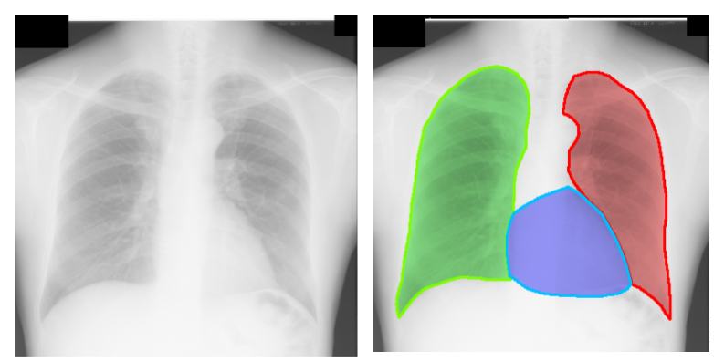
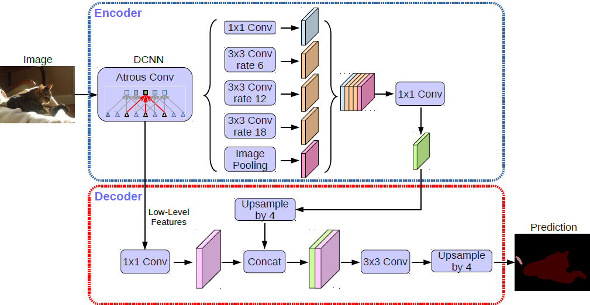
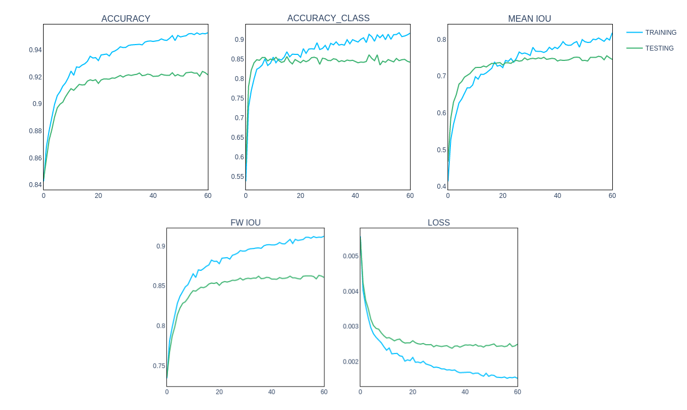

<!-- {: id="anim1"} -->
## Overview

Image segmentation is a commonly used technique to partition an image and generate pixel-wise masks for each instance. There are several interesting use cases for segmentation, ranging from medical data analysis to content-based image retrieval. 

However, is it possible to do image segmentation on data we do not have access to?
No, not now! 

Does that limit us to solve problems we care about?
Maybe, yes. 

Let us consider a scenario where top medical institutions have just learned about the novel coronavirus and intend to diagnose the illness using the chest X-ray images of symptomatic patients. Using these images, a segmentation model could be developed in order to facilitate early diagnosis. Unfortunately, this approach is not as straightforward as it sounds. We would inevitably encounter some significant bottlenecks while training the segmentation model. The most noteworthy concern would be data insufficiency due to privacy concerns where hospitals are unwilling to share sensitive patient records, besides lack of adequate computing resources. 

<!--  -->

{: id="pic1"}

Thus, the real problem lies in agglomerating all the information in a central location where the model will train. This brings us to the notion of federated learning! With federated learning, we can now take the model to the data instead of bringing the data to the model. 

- A centralized server maintains the global deep neural network model. 
- Each participating institution trains their own copy of the model using their respective datasets. 
- The central server then receives the updated model from each participant and aggregates the contributions.
- The model’s updated parameters are shared with the participants once again, as they continue their local training. 

This agreement of letting developers train the segmentation model on data they cannot have access to is the framework we have built and termed as FedSegment. Image segmentation has
never been studied in Federated Learning up until now and hence there is no easy-to-use framework to enable image segmentation applications. With the help of FedSegment, developers who are not experts in federated learning can conveniently leverage this technology and apply it in their systems for such applications.

<!--  -->
{: id="anim2"}

*****

## Approach

We simulate a federated learning architecture by adapting and training DeepLabV3+, a state-of-the-art model for image segmentation, and incorporating ResNet as the backbone for extracting feature maps. We develop a data loader for the PASCAL VOC dataset which supports partitioning of the data between our virtual clients in a non-I.I.D manner using Dirichlet, to represent real-world, scattered data. 

The Dirichlet distribution, parameterized by the concentration parameter 𝛼, is a density over a K dimensional vector whose K components are positive and sum up to 1. Dirichlet can support the probabilities of a K-way categorical event. In Federated Learning, we find that the K clients' sample numbers obey the Dirichlet distribution. This Latent Dirichlet Allocation (LDA) method was first proposed by Measuring the Effects of Non-Identical Data Distribution for Federated Visual Classification [6]. This can generate non-IIDness with an unbalanced sample number in each label. The figure below illustrates populations drawn for 4 clients from the Dirichlet distribution of the Pascal VOC dataset with 21 classes for different values of 𝛼.

{: id="niid"}

We have 5 worker threads out of which 4 are client-threads managed by their Client Managers and a server thread managed by a Server Manager. Client Managers execute the training process in the order that they receive weights from the Server Manager. In the first round, the Server Manager initializes the model and sends the weights to the Client Manager for each client. The Client Manager then sets up the client worker threads on their respective GPUs for training. Since we are training our architecture on 4 GPUs, each client is assigned one GPU. After completing the specified number of epochs, The Client Managers then send the trained weights to the Server Manager. The Server Manager instantiates the server thread to perform aggregation on model weights received from all the clients by scaling the weights with respect to the size of their local dataset. It then updates the model parameters, performs evaluation on the validation set and sends back the updated model weights to the Client Managers. The next round begins and the process continues for a given number of rounds. We employ the MPI communication protocol for the interactions between the server and its clients.

*****

## Implementation

<!--  -->
{: id="pic2"}

We perform image segmentation by training the Deeplabv3+ [3] model with ResNet-101 as backbone for feature maps extraction. DeepLabv3+ extends DeepLabv3 by adding a simple yet effective decoder module to refine the segmentation results especially along object boundaries. It uses the Resnet model as a backbone and applies the depthwise separable convolution to both Atrous Spatial Pyramid Pooling and decoder modules, resulting in a faster and stronger encoder-decoder network.

We build a segmentation model on top of the open source FedML framework [1, 2] by training the Deeplabv3+ - Resnet 101 model on the PASCAL VOC dataset comprising 10582 augmented training images and 2857 validation images. The centralized training of Deeplabv3+ in the research paper [3] serves as our reference baseline model which gives a mean Intersection-over-Union (mIoU) of 78.85%. We have achieved an mIoU of 75.57% in the federated setting. Assuming we have 4 virtual clients, we use 4 GPUs where we assign each client one GPU. By conducting several experiments, we have determined the following values for the training parameters to achieve good results: Batch Size: 10, output stride: 16, learning rate: 0.007, optimizer: SGD. We train the model for 60 rounds with 2 epochs per round. Since we are fine tuning the backbone, we chose to keep the learning rate small. However, the layers in the encoder-decoder structure of Deep Lab are not fine-tuned, but rather trained from scratch. For these layers, we provide a learning rate 10 times higher than the one backbone gets i.e. 0.07. We also dynamically modify the learning rates after a couple of iterations using the LR Scheduler. To increase the computational speed, we modified our evaluation approach to a small extent. Initially, the server would collect the updated model parameters and evaluate the model on the entire training and testing dataset while the clients would keep waiting around for the server to aggregate model parameters, complete the evaluation and send back the model weights. The only problem with this simulation was the bottleneck during evaluation because the evaluation would happen to utilise just one GPU for the server and all three other GPU’s would go unused. Our modified approach was to evaluate the updated model parameters as soon as the clients receive it on their respective resources, and send it back to the central server while sending the model parameters at the end of each round. This way, the central server would just have to aggregate the evaluation results of each client which removed the computational bottleneck we faced during the evaluation. In addition, we reduced the frequency of evaluation on the training dataset from evaluating at every epoch to evaluating at every fifth epoch for some of our experiments.

*****

## Experiments

We adapt the ImageNet-pretrained backbone to semantic segmentation by applying atrous convolution to extract dense features. We experimented with two backbones: Aligned-Xception and ResNet-101. Motivated by the recent success of depthwise separable convolution, we initially explored our experimentation by adapting Xception backbone [3] for extracting feature maps, and obtained an mIoU of ~10% on the validation dataset after 10 rounds. However the numbers surged when we plugged in the widely used ResNet Backbone. For an equivalent number of rounds, we reported a validation mIoU of ~60%. Even though the Xception backbone is believed to give better results with faster computation [3], our experimentation proved otherwise in this case. After further scrutiny, we figured that the discrepancy was mainly because of the pretrained weights being used. The initial implementation which consisted of a slight modification of Xception backbone called Aligned Xception [5] did not utilize fully pretrained weights, which resulted in poorer metrics. Hence we decided to move forward with the ResNet Backbone for which fully pretrained weights were readily available.

In addition to experimenting with two different backbones, we also experimented with different output strides. The output stride is defined as the ratio of input image spatial resolution to final output resolution. For the task of semantic segmentation, one can adopt an output stride of 16 (or 8) for denser feature extraction. Theoretically, lowering the output stride improves the performance marginally, however it adds a lot of extra computational complexity and hence using an output stride of 16 strikes the best trade-off between speed and accuracy. With the limited resources we had, we could only train our models for upto 15 rounds with an output stride of 8 as outlined in the table below. 

| Backbone | Batch Size | Epochs | Rounds | Learning Rate | Testing Accuracy | Testing Loss | mIoU | fWIoU |
|---|---|---|---|---|---|---|---|---|
| ResNet-101 | 6 | 2 | 15 | 0.007 | 0.899 | 0.0083 | 0.655 | 0.828 | 
| **ResNet-101** | **10** | **2** | **60** | **0.007** | **0.924** | **0.0024** | **0.755** | **0.863** | 
| Xception | 6 | 2 | 60 | 0.007 | 0.6445 | 0.0195 | 0.048 | 0.419 | 

*****

## Results

As shown in the table above the model architecture which gave us the best results [4] was with output_stride = 16, batch_size = 10 with a learning rate of 0.007 while fine-tuning the backbone and 0.07 for all the remaining layers. We trained the model only until 60 rounds as the model reaches saturation stage and the validation accuracy does not improve post that. At each round, the model was trained for 2 epochs locally by all four clients. The results for the best performing federated architecture for our model are as shown in the graph below.

<!--  -->
{: id="final-graphs"}

Below are the results of the visualization:

{: id="final-visualization"}

*****

## Challenges

We identify three major challenges for using the above mentioned segmentation method in a real world setting:
    
1. Computational Complexity:
Since image segmentation is a computationally expensive task, hence edge devices with resource constraint will always face challenges for our method. There are few ways to reduce the computational complexity for e.g reducing the complexity of training by freezing the backbone or keeping a higher output_stride but all of that will come at the cost of losing some accuracy. So, there is again a tradeoff to make between accuracy and computational complexity.

2. Statistical Heterogeneity:
Since devices frequently generate and collect data in a non-identically distributed manner across the network, hence the number of data points across edge devices may vary significantly and this data generation paradigm violates frequently-used independent and identically distributed (I.I.D) assumptions in distributed optimization. To mitigate this problem, the recommended approach is to simulate the non-IID setting as closely as possible while training the model so the model learns to generalize and adapts to this nature of data generation.

3. Privacy Concerns:
Even though the entire concept of federated learning is to protect the privacy of data, privacy is still a major concern in federated learning applications including image segmentation. Even though federated learning makes a step towards protecting data generated on each device by sharing model updates, e.g, gradient information, instead of raw data. However, communicating model updates throughout the training process can still reveal sensitive information either to a third-party or to the central server. From the shift in gradient at each state, there are some statistical ways to infer a good amount of information about the data points that are supposed to be private. While recent methods aim to enhance the privacy of federated learning using tools such as multipart computation or differential privacy, these approaches often provide privacy at the cost of reduced model performance or system efficiency. Hence there is a need to understand and balance these tradeoffs while using a federated segmentation approach.

*****

## Future Work

We intend to work on the following points going forward:

1. Improving accuracy of the model - 
In addition to hyper-parameter tuning, we plan to work on improving the model accuracy by experimenting with smaller output strides. As mentioned above, the reduction of output strides comes at the cost of computational complexity. To keep the computational complexity in check, we can freeze the backbone and try experimenting with output stride of 8 or 4. Additionally, plugging a better loss function (Dice + Focal Loss) instead of Cross-Entropy Loss may also be helpful. Lastly, pre-training the model on the Coco Dataset and fine-tuning it on Pascal can give better results; Pascal has a small dataset which is further split into N number of clients and there is a good chance for the model to overfit when data is split amongst more number of clients.

2. Integrating other popular segmentation models - 
We also intend to explore and incorporate alternate backbones to train the DeepLabV3+ model such as Xception and MobileNet with fully pretrained models, resulting in state-of-the-art accuracy. While our current approach is limited to using the ResNet backbone, with a better-trained Xception backbone, we expect to get similar or better results. We also plan to extend our current work and encompass additional segmentation models such as EfficientFCN or BlendMask under the FedSegment umbrella.

*****

## Resources

1. [FedML Library](https://fedml.ai/)
2. [FedML: A Research Library and Benchmark for Federated Machine Learning, Chaoyang He et. al](https://arxiv.org/abs/2007.13518)
3. [Encoder-Decoder with Atrous SeparableConvolution for Semantic Image Segmentation, Liang-Chieh Chen et. al](https://arxiv.org/pdf/1802.02611.pdf)
4. [Logs of our experiment (wandb)](https://wandb.ai/elliebababa/fedml/runs/5ykbr3ul)
5. [Pytorch Deeplab Xception](https://github.com/jfzhang95/pytorch-deeplab-xception)
6. [Measuring the Effects of Non-Identical DataDistribution for Federated Visual Classification, Tzu-Ming Harry Hsu et. al](https://arxiv.org/pdf/1909.06335.pdf)
7. [Chest X-ray image segmentation picture](https://towardsdatascience.com/can-machine-learning-read-chest-x-rays-like-radiologists-part-2-aa77dba219f0)

