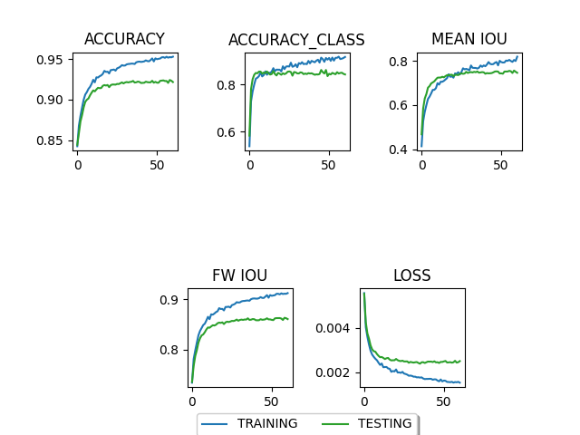

# FedSegment

## A Federated Learning Framework for Image Segmentation

### Our project is in collaboration with FedML, a research library and benchmark for federated machine learning, developed at USC. Our module will be an open source contribution to FedML. 

*****

### Overview

Image segmentation is a commonly used technique to partition an image and generate pixel-wise masks for each instance. There are several interesting use cases for segmentation, ranging from medical data analysis to content-based image retrieval. 

However, is it possible to do image segmentation on data we do not have access to?
No, not now! 

Does that limit us to solve problems we care about?
Maybe, yes. 

Let us consider a scenario where top medical institutions have just learned about the novel coronavirus and intend to diagnose the illness using the chest X-ray images of symptomatic patients. Using these images, a segmentation model could be developed in order to facilitate early diagnosis. Unfortunately, this approach is not as straightforward as it sounds. We would inevitably encounter some significant bottlenecks while training the segmentation model. The most noteworthy concern would be data insufficiency due to privacy concerns where hospitals are unwilling to share sensitive patient records, besides lack of adequate computing resources. 

Thus, the real problem lies in agglomerating all the information in a central location where the model will train. This brings us to the notion of federated learning! With federated learning, we can now take the model to the data instead of bringing the data to the model. 

- A centralized server maintains the global deep neural network model. 
- Each participating institution trains their own copy of the model using their respective datasets. 
- The central server then receives the updated model from each participant and aggregates the contributions.
- The model’s updated parameters are shared with the participants once again, as they continue their local training. 

This agreement of letting developers train the segmentation model on data they cannot have access to is the framework we have built and termed as FedSegment. 

### Approach

We simulate a federated learning architecture on image segmentation by adapting and training DeepLabV3+, a state-of-the-art model for image segmentation, by incorporating the Resnet network as the backbone for extracting feature maps. We develop a data loader for the PASCAL VOC dataset which supports non-I.I.D. distribution to represent real-world, distributed data that naturally tends to be non-I.I.D. Assuming we have virtual clients and a centralized server, the data loader partitions training image dataset in the non-I.I.D format. 

The server sends initial weights of the model to all the clients in the beginning. The clients start training on their own subset of data and send weights to the server. The server gathers the weights from all the clients and performs aggregation on the weights. The aggregated weights are sent back to the clients and the training continues. This entire loop is called one round. Many such rounds are simulated in order to achieve a decent accuracy. 

### Implementation

We perform image segmentation by training the Deeplabv3+ model with ResNet-101 as backbone for feature maps extraction. Deeplabv3+ is the recent image segmentation model which uses Atrous Spatial Pyramid Pooling(ASPP) for encoding multi-scale contextual information as well as an encoder-decoder architecture to recover location/spatial information. 

Using the open source FedML framework on the PASCAL VOC dataset with 10582 augmented training images and 2857 validation images, we train the Deeplabv3+ - Resnet 101 model. The centralized training of Deeplabv3+ in the paper is our reference baseline model which gives an mIoU of 78%. We have achieved an mIoU of 75% in the federated setting. Assuming we have 4 virtual clients, we use 4 GPUs where we assign each client one GPU. The training parameters are as follows - batch size = 10, output stride = 16, learning rate  = 0.007, SGD optimizer. We run 200 rounds with 2 epochs per round.  A saver is implemented to save checkpoints of the best validation prediction of mIoU.

### Experiments

### Results

### Challenges

### Future Work

There are two things that we can work on:
 - Improving accuracy of the model - In addition to hyper parameter tuning, we can further try to improve on accuracy by experimenting with other aggregation methods e.g, FedMA instead of FedAvg. Also, plugging a better loss function (Dice + Focal Loss) instead of Cross-Entropy Loss may be helpful

- Integrating other popular segmentation models - We also intend to explore and incorporate alternate backbones to train the DeepLabV3+ model - such as Xception, MobileNet which have pretrained models resulting in SOTA accuracy. Currently, our approach is limited to using the ResNet backbone. We also plan on extending our current work and encompass additional segmentation models such as EfficientFCN or BlendMask under the FedSegment umbrella.

